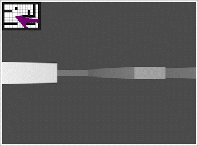

# raycasting

This is a prototype to demonstrate a rendering technique called ray casting. It was made popular in video games by id Software through use in their first-person
shooter Wolfenstein 3D. The JavaScript file uses functions from p5.js to make rendering easier but the algorithms for determining player angle,
distance from wall, closest wall, etc. were coded from scratch. JavaScript was used for this prototype because it is easier to create a proof of concept
when you don't have to worry about memory allocation, data types or a lack of rendering functions built into a language like C. This prototype will be ported and
extended to C while also leveraging SDL to create a working ray casting renderer in the style of Wolfenstein 3D.

To run the prototype, download or clone this repository and navigate to the folder and right click on the file named "index.html" and select "Open With" and
choose your browser of choice. Moving the player around the grid uses the up, down, left, and right arrow keys.
